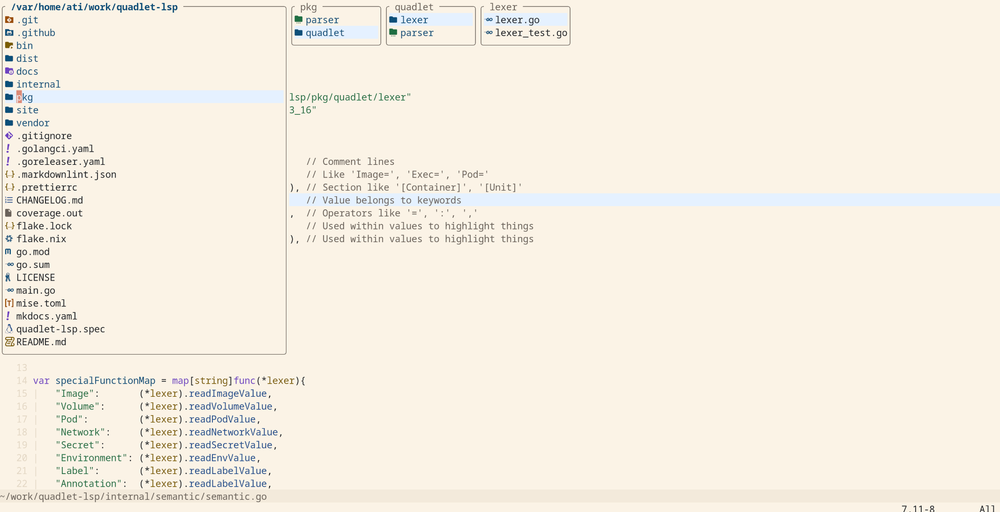
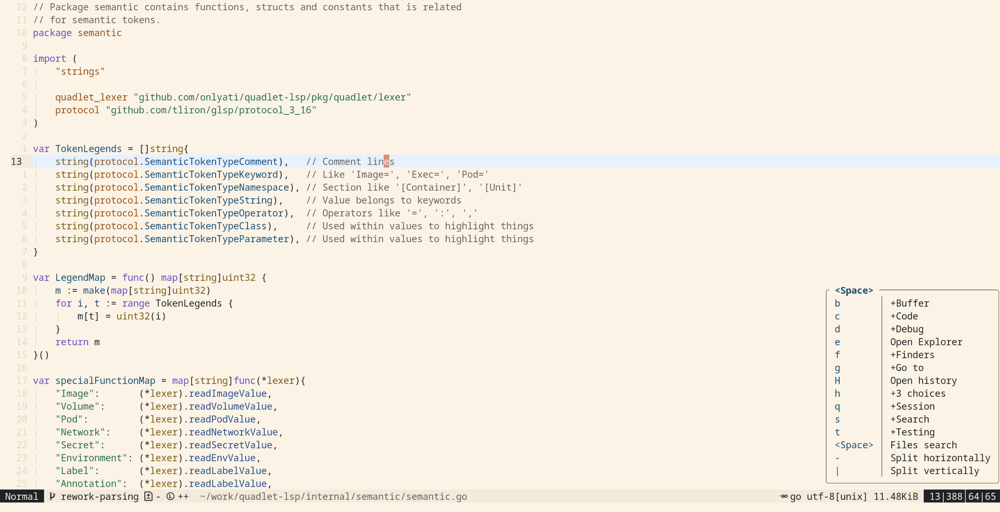
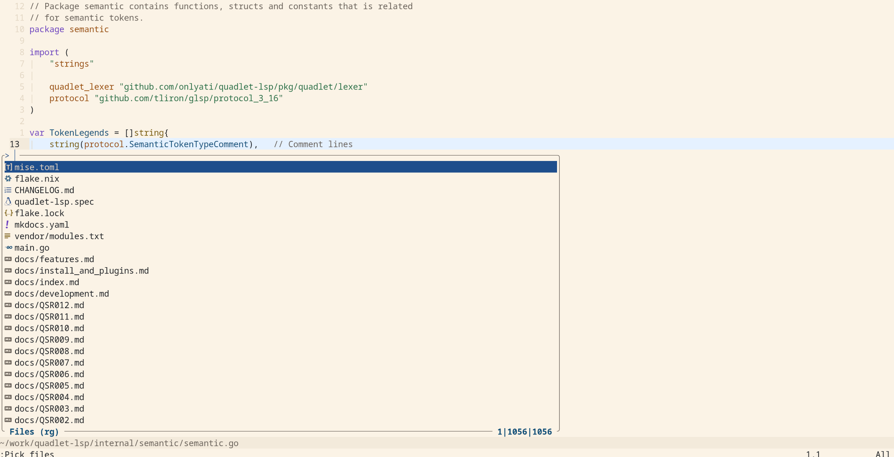
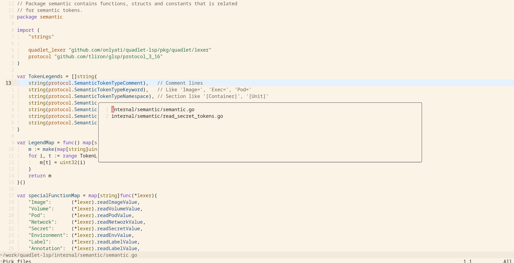
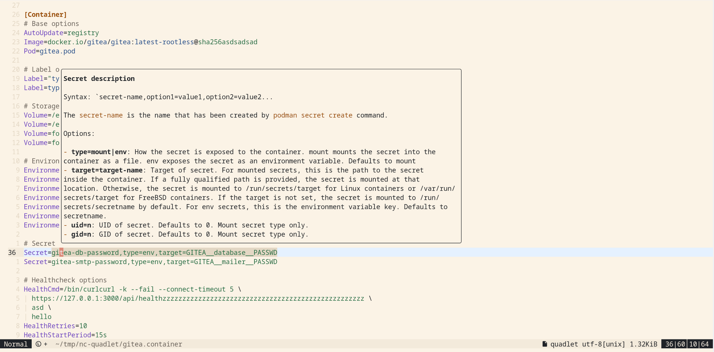
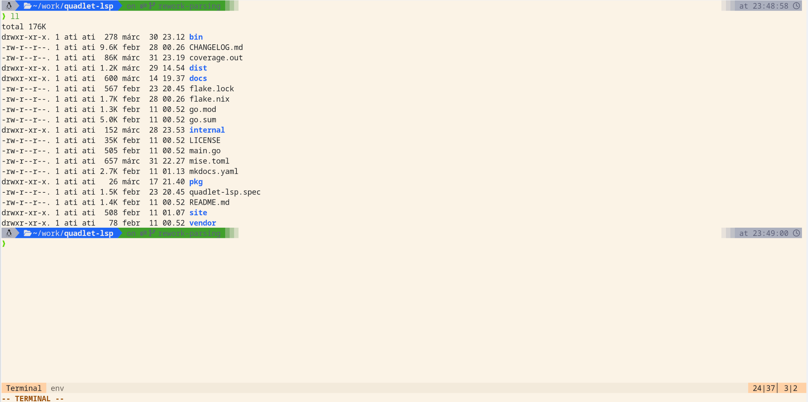
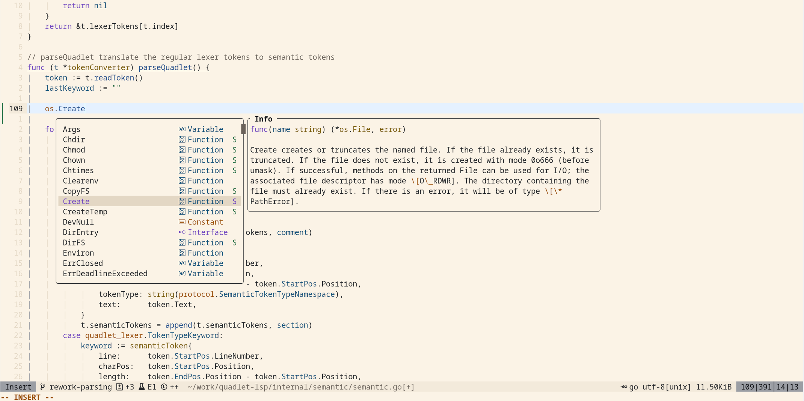

# Neovim config

This is my Neovim config that is used with 0.12 version. This is a minimal
simple setup. This is build on `vim.pack` as package manager and mostly built on
a few `mini.nvim` plugins.

## Screenshots

